<div align="center">


# SDC Learn

**The online learning platform of Skill Development Council Karachi**

Live Zoom classes · recorded sessions · resources · assignments · certificates — in one place.


[Quick start](#-quick-start) · [Features](#-features) · [Screenshots](#-screenshots) · [Architecture](#-architecture) · [Roles & permissions](#-roles--permissions) · [Docs](#-documentation)

</div>

---

## ✨ Overview

SDC Learn turns SDC Karachi's training programmes — diplomas, certificates, workshops and short courses — into a modern online experience. It follows the [Business Requirements Document](docs/BRD_SDC_Online_Learning_Platform.md) and is built with plain HTML, CSS and JavaScript plus a small Express server, so it runs anywhere with no build step.

| 🎓 Learners | 🧑‍🏫 Instructors | 🛡️ Coordinators |
|---|---|---|
| Attend live classes, rewatch recordings, download resources, submit assignments, track progress and earn verifiable certificates | Build courses session by session, share material, grade submissions, take attendance and publish results | Run the catalogue, enrollments, people, **roles & permissions**, fees, certificates, reports and every platform setting |

---

## 🚀 Quick start

```bash
npm install
```

```bash
npm start
```

Open **http://localhost:3000** and use a demo account (password `Demo@123`):

| Role | Email | What you'll see |
|---|---|---|
| 🛡️ Coordinator | `admin@sdclearn.demo` | Full console and settings |
| 🧑‍🏫 Instructor | `instructor@sdclearn.demo` | Their courses, grading, attendance |
| 🎓 Learner | `learner@sdclearn.demo` | My Courses — one class is live today |
| 💼 Accounts Officer | `accounts@sdclearn.demo` | A custom role limited to fees |

Live: **https://ead-university-portal-ten.vercel.app** · Full setup, Google sign-in, environment variables and deployment: **[SETUP.md](SETUP.md)** · Walkthroughs and troubleshooting: **[RUN.md](RUN.md)**

---

## 🧩 Features

<table>
<tr>
<td width="50%" valign="top">

### 🎓 Learning experience
- **My Courses** with progress, "Live today" and "Due soon" cards
- Sessions grouped by module with status badges — *Upcoming · Today · Available · Completed · Locked*
- Embedded recordings (YouTube, Vimeo, Google Drive, MP4)
- Downloadable resources, prev/next, **mark as complete**
- **Zoom** panel (join link, meeting ID, passcode, copy) and **Help** panel on every course page
- Course outline with outcomes and module roadmap
- Drag-and-drop **assignment submission**, replace until graded
- Calendar, attendance, results, certificates, fees, messages

</td>
<td width="50%" valign="top">

### 🛠️ Teaching & administration
- **Course builder** — sessions, recordings, resources, per-session Zoom, assignments, reordering
- Grading with marks, quick feedback and notifications
- Attendance per session with bulk marking
- Weighted results with configurable grade bands
- Enrollments with **full or per-session access**
- Certificates with **public verification** page
- Fees, announcements, messaging, reports & CSV exports
- Backup, restore and demo reset

</td>
</tr>
<tr>
<td valign="top">

### 🔐 Roles & permissions
- **Sign in with Google** (via Supabase Auth) or email & password
- Create unlimited roles; full create / edit / duplicate / delete
- **20 modules × view · create · edit · delete · publish**
- **Course access**: all, assigned, enrolled or hand-picked courses
- Menus, pages and buttons adapt automatically

</td>
<td valign="top">

### 🎨 Configurable without code
- Branding, logos, contact details, colours, light/dark theme
- **Terminology** — rename Learner, Course, Session, Batch…
- Upload limits & file types, late policy, attendance threshold
- Result weights, pass mark, certificate rules
- Program types, levels, delivery modes, fee types
- Feature toggles for every optional module

</td>
</tr>
</table>

---

## 📸 Screenshots

| Sign in | My Courses |
|---|---|
| 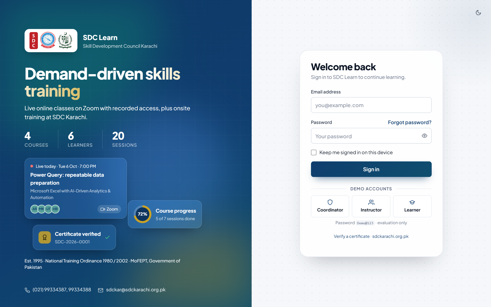 | 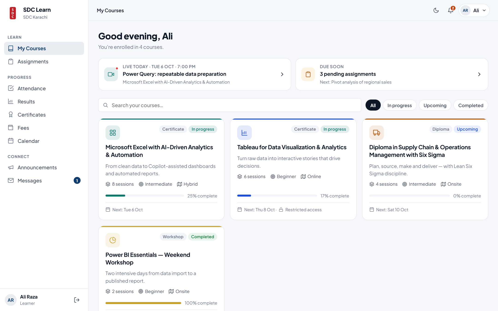 |
| **Course home** | **Session page** |
| 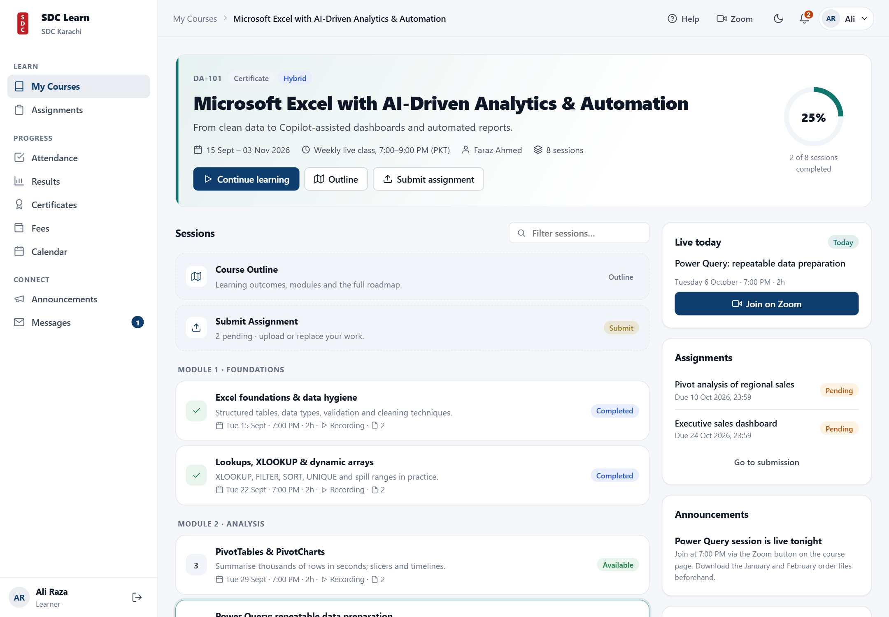 | 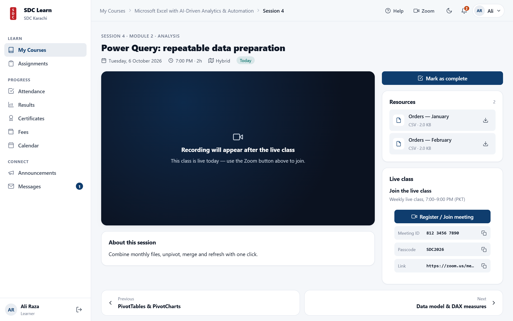 |
| **Assignment submission** | **Coordinator dashboard** |
| 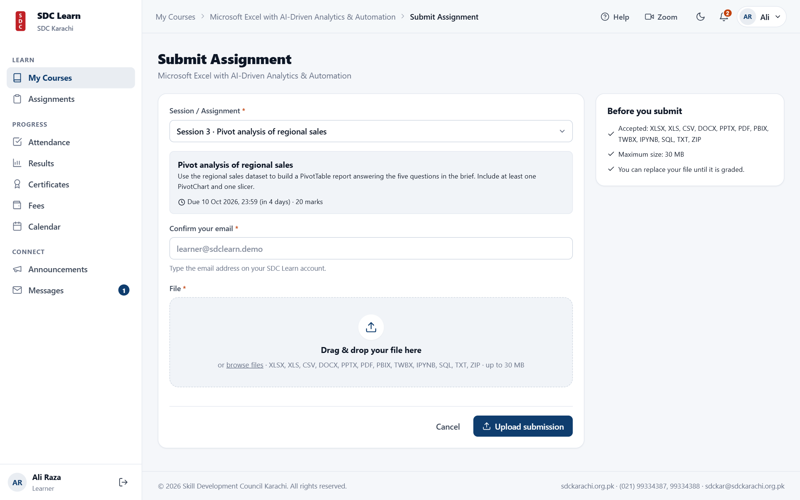 | 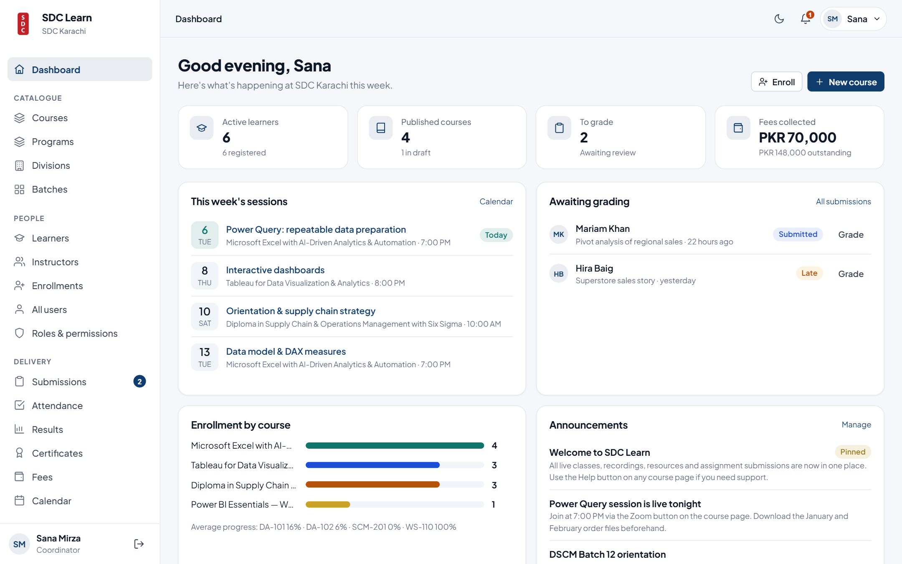 |
| **Course builder** | **Roles & permissions** |
| 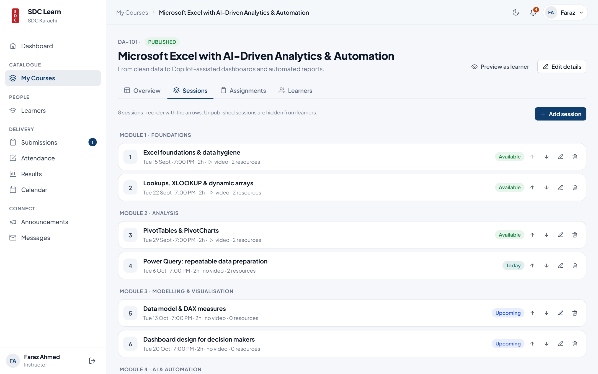 | 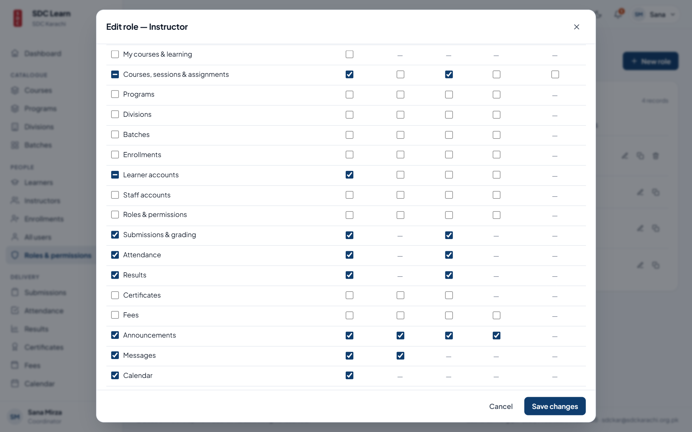 |
| **Dark mode** | **Mobile** |
| 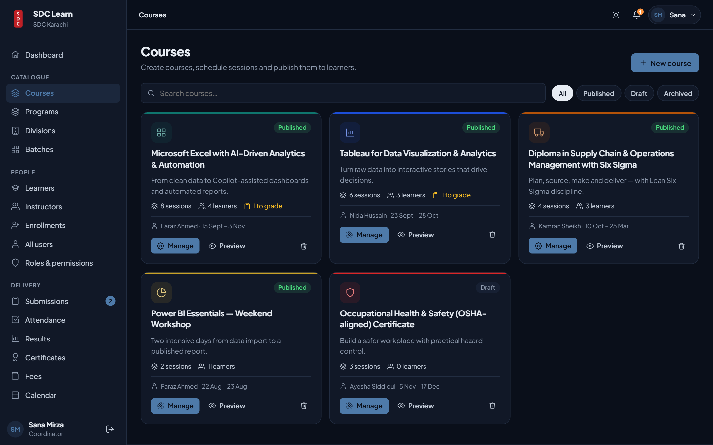 | 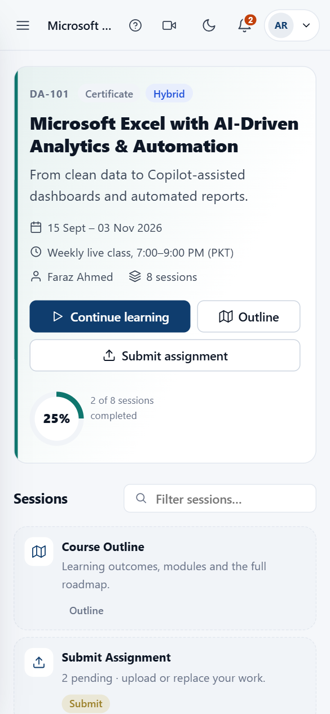 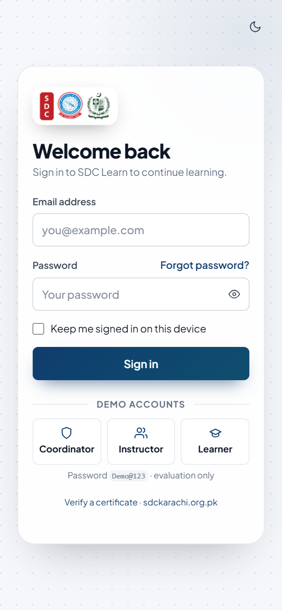 |

---

## 🏗️ Architecture

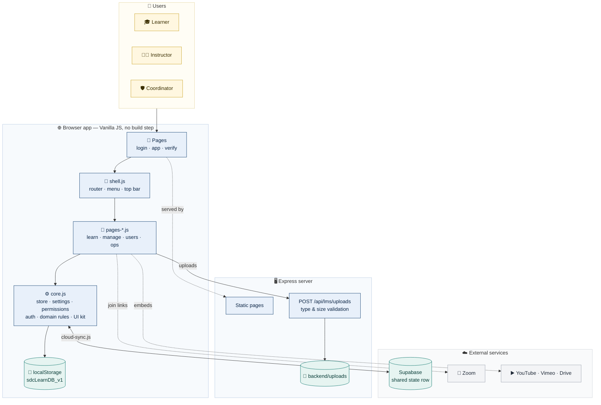

**Key design choices**

| | Choice | Why |
|---|---|---|
| ⚡ | **Browser-first data** — one JSON state in `localStorage` | Instant UI, works offline and from any static host |
| ☁️ | **Optional Supabase mirror** | Shared data across devices without writing an API |
| 🧱 | **No framework, no bundler** | Easy to host, audit and hand over; matches the original stack |
| 📁 | **Server only for files** | Browsers can't store shared uploads; everything else stays client-side |
| 🔐 | **One permission function (`can`)** | Menus, routes and buttons all ask the same question |

### Page structure

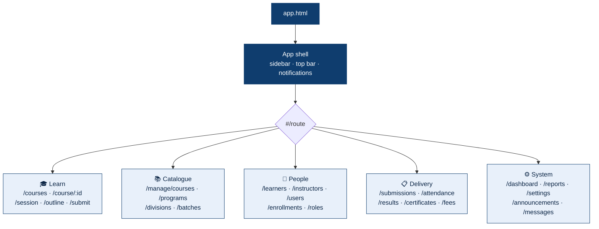

---

## 🔐 Roles & permissions

Every role combines an **experience**, a **course access scope** and a **permission matrix**. The same check decides what appears in the menu, which pages open and which buttons show.

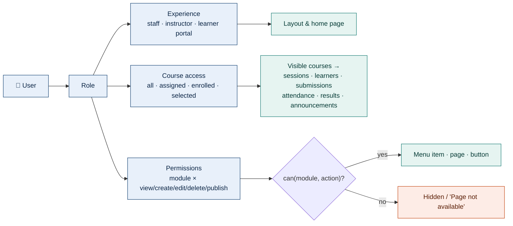

| Built-in role | Experience | Course access | Highlights |
|---|---|---|---|
| 🛡️ Coordinator | Staff console | All | Full access — locked so no one can be locked out |
| 🧑‍🏫 Instructor | Instructor console | Assigned | Edit own courses, grade, attendance, results |
| 🎓 Learner | Learner portal | Enrolled | Learn, submit, view own progress |
| 💼 Accounts Officer *(example custom)* | Staff console | All | Fees, read-only learners, reports |

---

## 🔄 Key flow — submitting an assignment

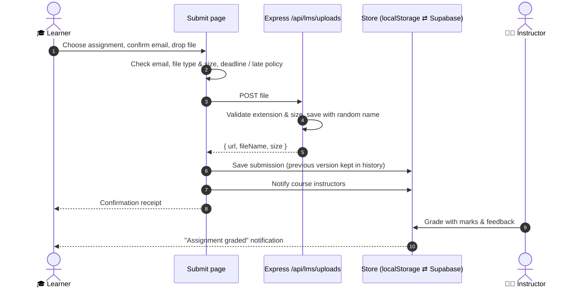

---

## 🗂️ Data model

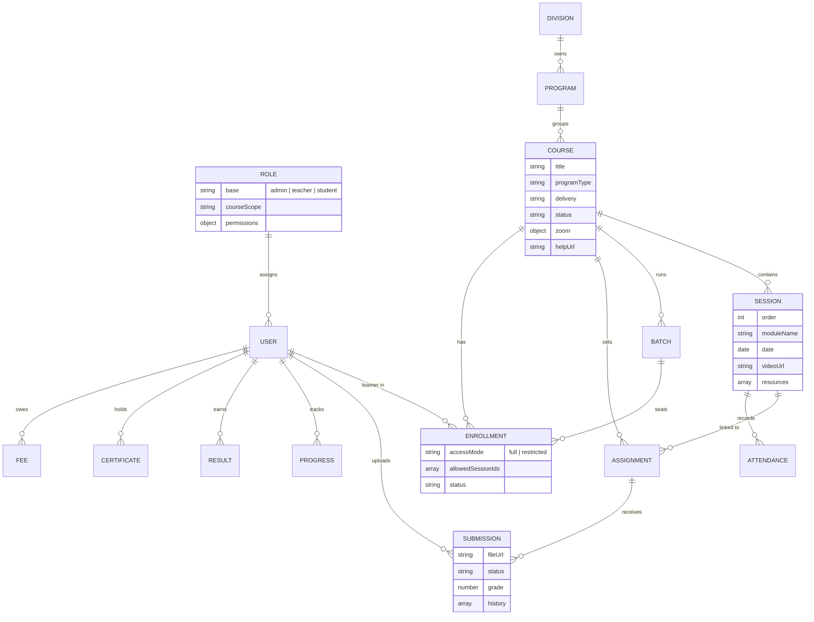

Full field reference: [docs/IMPLEMENTATION.md](docs/IMPLEMENTATION.md#data-model)

---

## 📁 Project structure

```
📦 SDC Learn
├── 📄 login.html · app.html · verify.html · index.html
├── 🎨 css/app.css                 design system — tokens, light/dark, responsive
├── 📜 js/
│   ├── core.js                    store · settings · roles & permissions · auth · UI kit
│   ├── shell.js                   router · permission-aware menu · top bar
│   ├── pages-learn.js             learner course delivery
│   ├── pages-manage.js            courses · sessions · enrollments · catalogue
│   ├── pages-users.js             accounts · roles & permissions
│   ├── pages-ops.js               dashboards · grading · attendance · results · fees · settings
│   ├── seed.js                    demo catalogue (dates relative to today)
│   ├── login.js                   animated sign-in
│   └── cloud-config.js · cloud-sync.js   optional Supabase sync
├── 🖥️ backend/server.js           Express — static pages · validated uploads · health
├── 🖼️ assets/brand · assets/resources
├── 🧪 tests/core.test.js · tests/e2e.browser.js
└── 📚 docs/IMPLEMENTATION.md · BRD · screenshots
```

---

## 🧪 Testing

| Suite | Command | Covers |
|---|---|---|
| Logic | `npm test` | Permissions, course scoping, grading, restricted access, password hashing |
| Syntax | `npm run check` | Every script parses |
| UI workflows | browser console — see [RUN.md](RUN.md#tests) | **29 end-to-end workflows** across every module and role, driving real clicks and forms |

---

## 🔒 Security notes

- Passwords are stored only as **salted, iterated SHA-256 hashes**.
- Uploads are validated **on the server** (extension + size), stored under random names and served as downloads with `nosniff`.
- Permission checks run in the browser: they control the experience but are **not a server-side boundary**. For public deployments, follow [supabase/PRODUCTION_SECURITY_NOTES.md](supabase/PRODUCTION_SECURITY_NOTES.md) and the [production checklist](SETUP.md#9-production-checklist).

---

## 📚 Documentation

| | Document | Contents |
|---|---|---|
| ⚙️ | [SETUP.md](SETUP.md) | Install, environment variables, Settings, Supabase, Neon, deploy to Render / Vercel, production checklist |
| ▶️ | [RUN.md](RUN.md) | Running, demo walkthroughs per role, tests, troubleshooting |
| 🏗️ | [docs/IMPLEMENTATION.md](docs/IMPLEMENTATION.md) | Architecture, file map, data model, permission engine, routes, extending |
| 📋 | [docs/BRD](docs/BRD_SDC_Online_Learning_Platform.md) | Business requirements |

---

<div align="center">


**Skill Development Council Karachi**
Est. 1995 · National Training Ordinance 1980 / 2002 · MoFEPT, Government of Pakistan

📞 (021) 99334387, 99334388 · ✉️ sdckar@sdckarachi.org.pk · 🌐 [sdckarachi.org.pk](https://sdckarachi.org.pk/)

</div>
